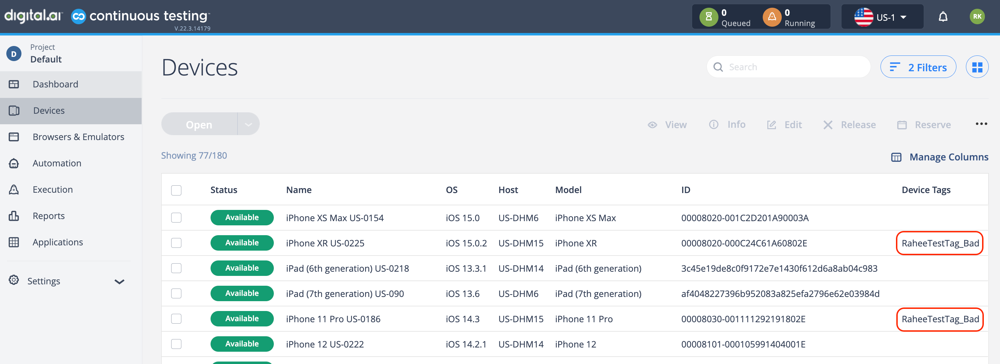

## Script for Check Devices WiFi State

### Prerequisites

**config.properties** needs to be updated to provide the following information:

```commandline
[seetest_authorization]
access_key=<insert access key>

[seetest_urls]
cloud_url=https://uscloud.experitest.com # replace with your Cloud URL
```

### Purpose

The purpose of this script is to help and minimize the effort for Cloud Admins by simply running a script that will tag the devices that are not connected to the desired WiFi.

The Device Tags are reflected in the UI when looking at the Devices Page:



### Flow

This is the flow of the script and what it does when triggered:

- Get list of all devices from SeeTest Cloud
- Get the state of devices
    - If device is Online - Trigger Appium Script which does the following steps:
      - Reserve Device
      - Launch Device Settings
      - Check which WiFi Device is connected to
        - If connected to CORRECT WiFi - Add relevant tag
        - If connected to INCORRECT WiFi - Add relevant tag
      - Release Device Session

The Tags can be custom and defined in **config.properties**:

```commandline
[tags]
good_tag_value=RaheeTestTag_Good
bad_tag_value=RaheeTestTag_Bad
```

And the WiFi SSID to check can also be custom and defined in **config.properties**:

```commandline
[wifi]
wifi_name=UKCustomers_ALL
```

The script will trigger the Appium Sessions in parallel based using multi-threading concept.
If there are 50 Devices in Available state, there will be 50 sessions being triggered at once.

### How to set up the environment

Open a Terminal window in the project root folder, and type in the following commands:

```commandline
python3 -m pip install --user virtualenv
python3 -m venv env
source env/bin/activate
pip3 install -r requirements.txt
```

Above steps creates a local virtual environment where Python3, Pip3 and all relevant dependencies reside.

To run the script, running the following command:

```commandline
./env/bin/python3 main.py
```

As long as the ./env folder exist, for each execution we can simply run above command, no need to re-run all the commands each time.